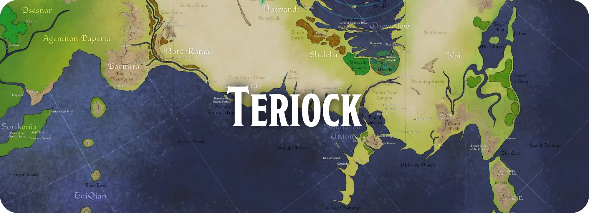
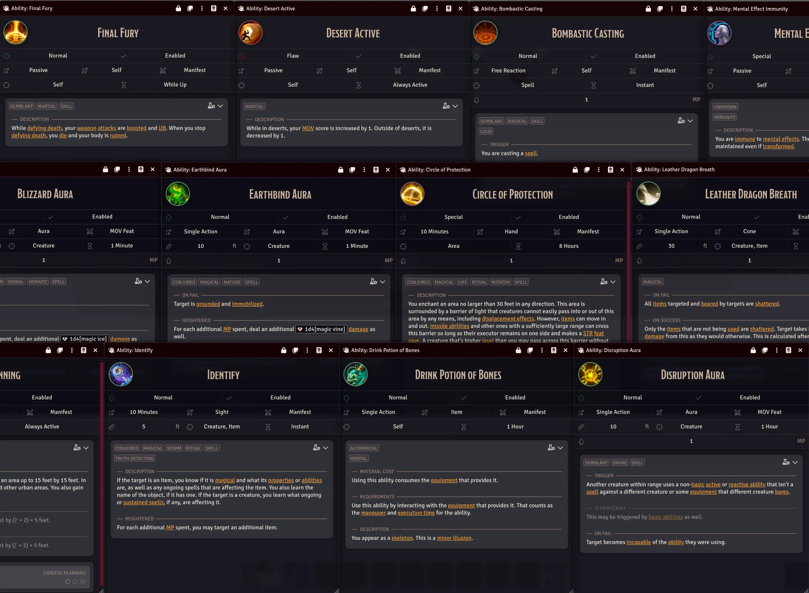
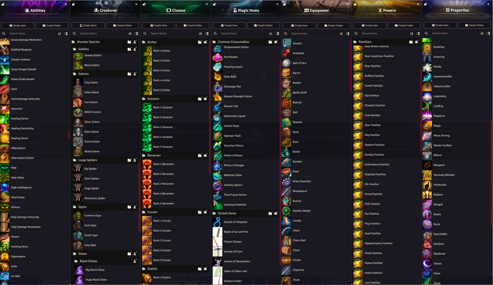
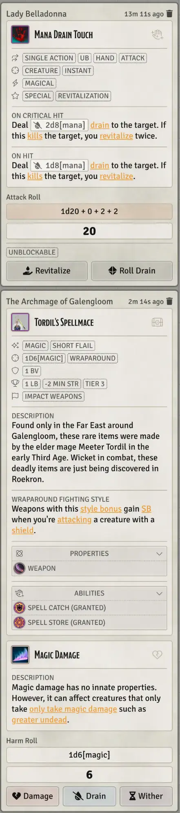
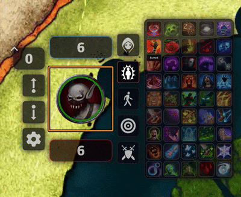
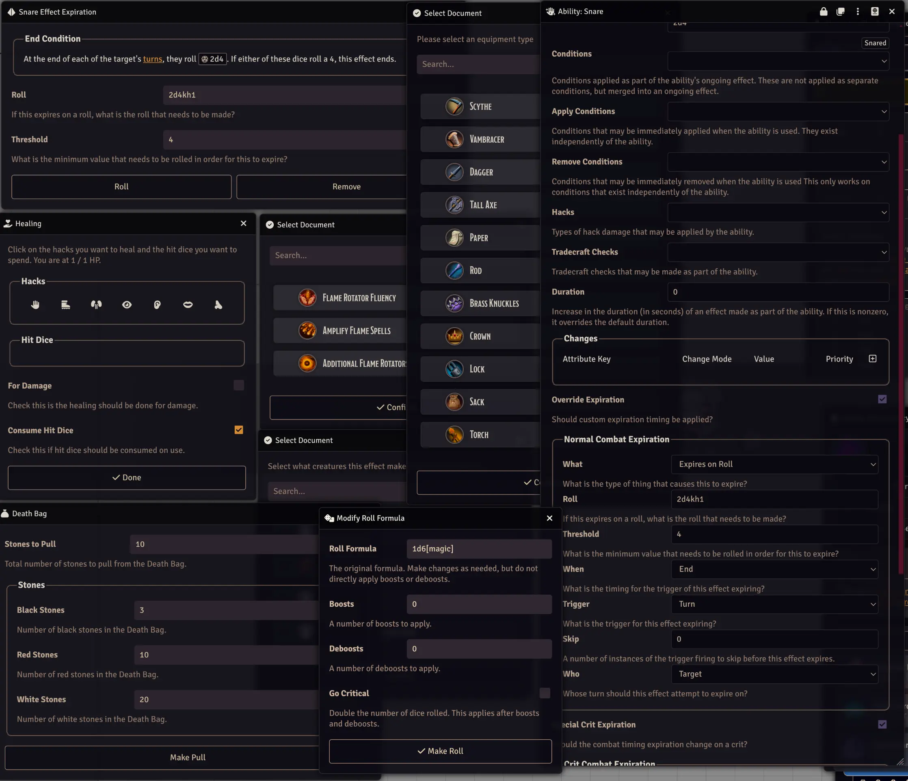
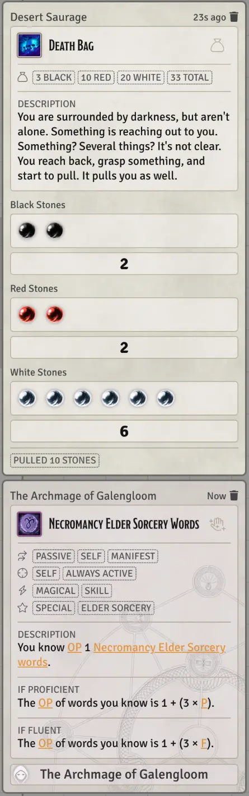
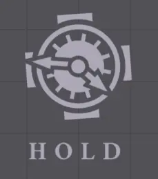

# Teriock Virtual Tabletop

This is a first party implementation of the [Teriock](https://wiki.teriock.com) game system
for [Foundry Virtual Tabletop](http://foundryvtt.com/). It is officially supported and deeply integrated with the
Teriock wiki so that rules and content should be synchronized and up to date.

## Installation

Teriock can be installed by copying the following [manifest link](./system.json) into Foundry's system installation
window.

```
https://raw.githubusercontent.com/GabePoel/Teriock-FoundryVTT/refs/heads/main/system.json
```

## Features

### Deep Ability Integration



### All Core Content Built In



### Easy Tooltips and Menus


### Chat Message Automation



### Module Integration



### Excessive Options and Dialogs



### Spinning Things



