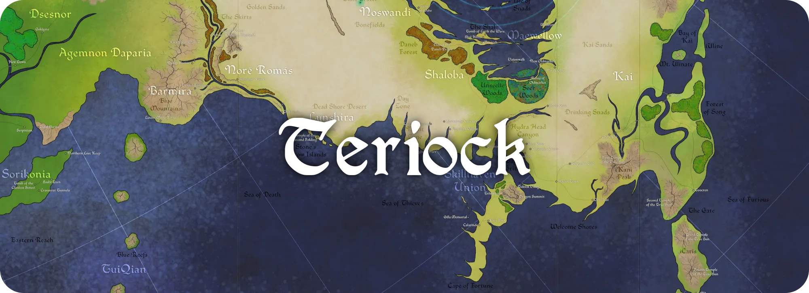

# Teriock Virtual Tabletop

This is a first party implementation of the [Teriock](https://wiki.teriock.com) game system
for [Foundry Virtual Tabletop](http://foundryvtt.com/). It is officially supported and deeply integrated with the
Teriock wiki so that rules and content should be synchronized and up to date. It is designed to exist as a stand-alone system that provides everything needed to run games without any additional modules.

## Installation

Teriock can be installed by copying the following [manifest link](./system.json) into Foundry's system installation
window.

```
https://github.com/GabePoel/Teriock-FoundryVTT/releases/latest/download/manifest.json
```

## Features

### Attractive Character Sheets

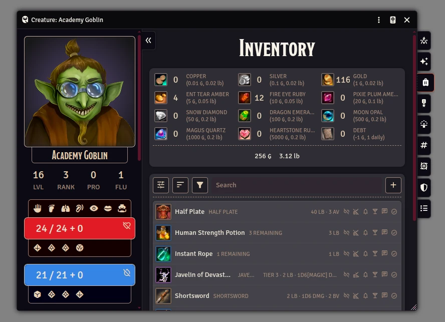

### All Core Content Included

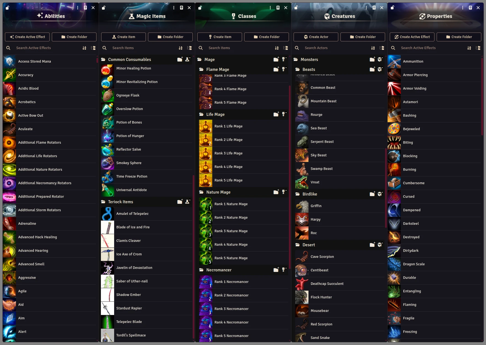
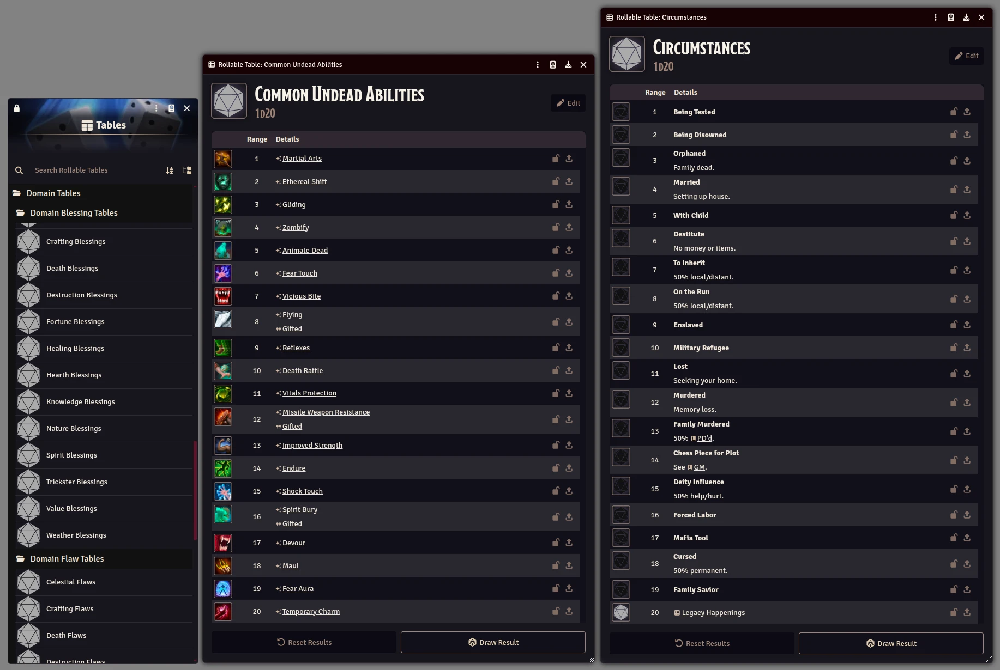
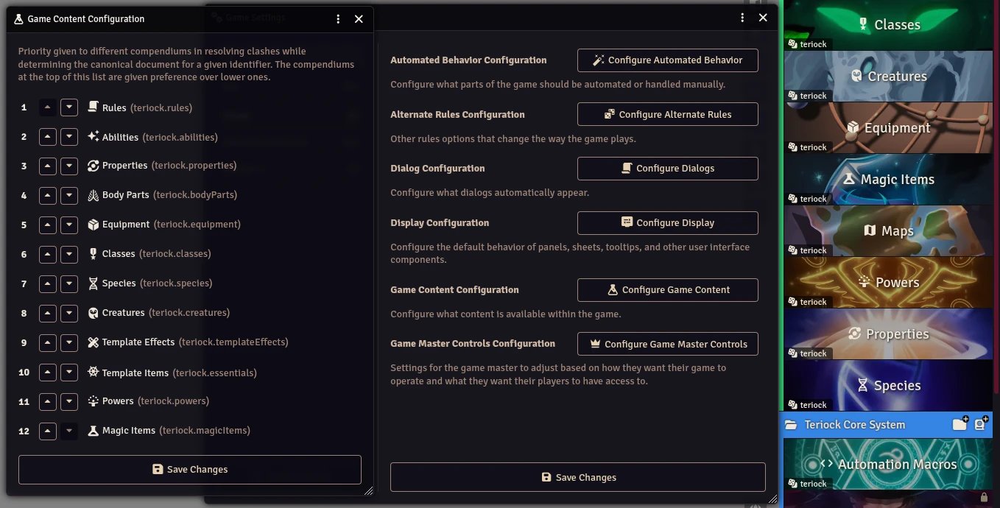

### Deep Ability Integration

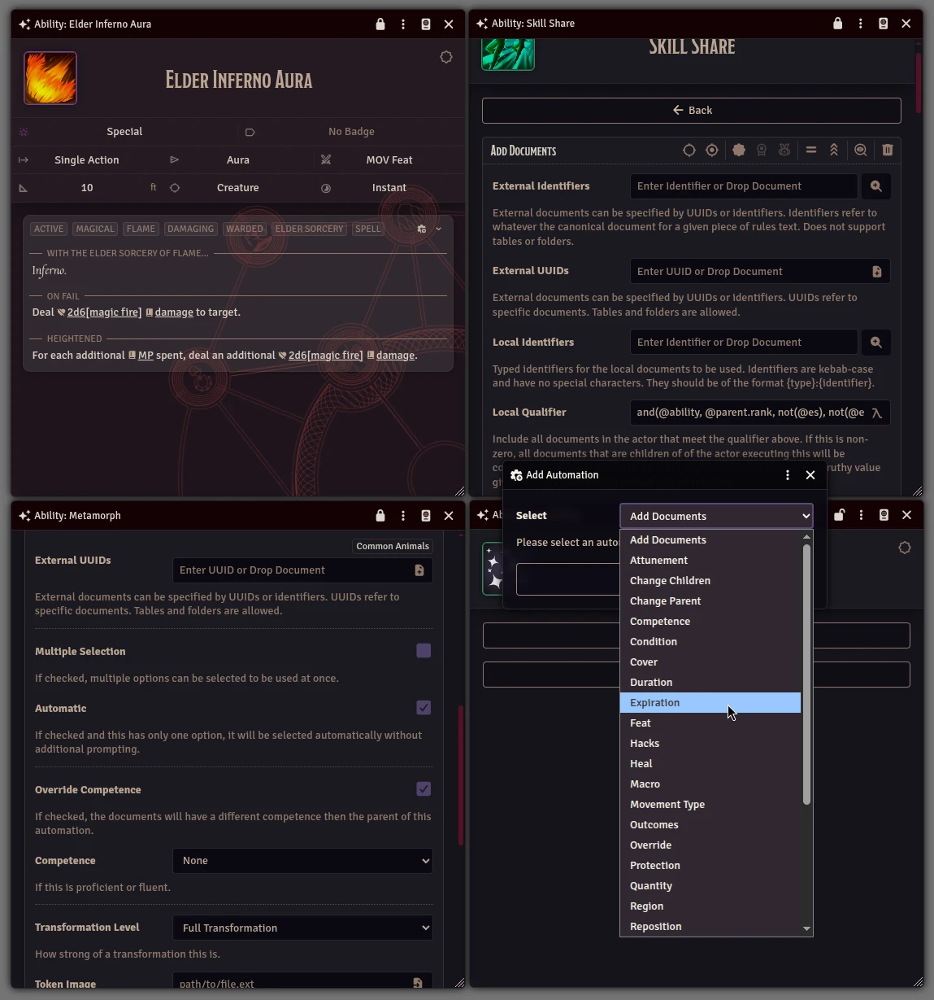
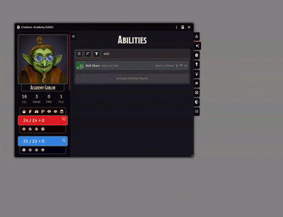

### Easy Tooltips and Menus

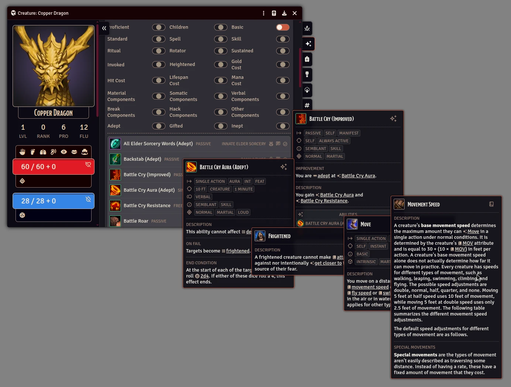

### Rich Chat Messages

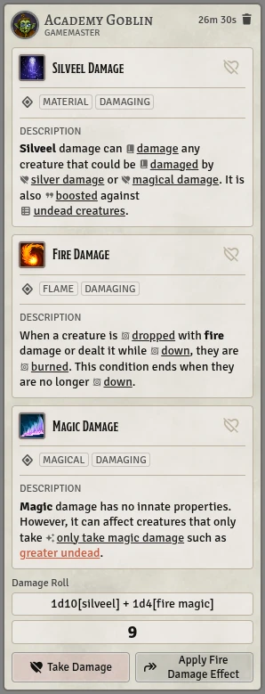
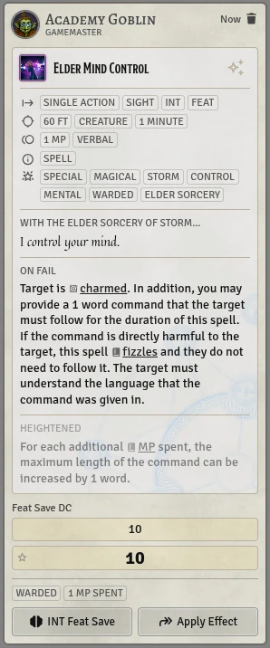
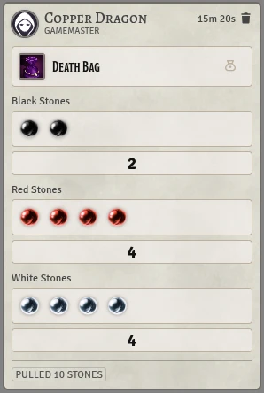

### Custom Damage Types

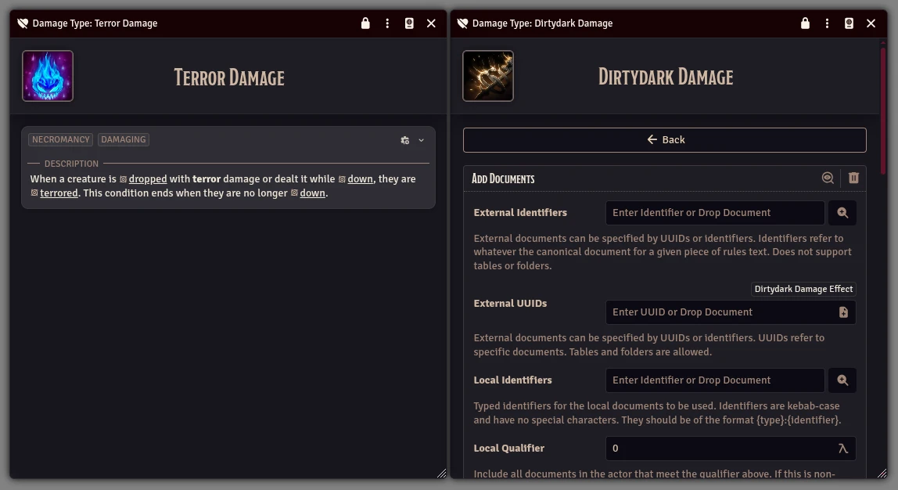

### Custom Detection Modes

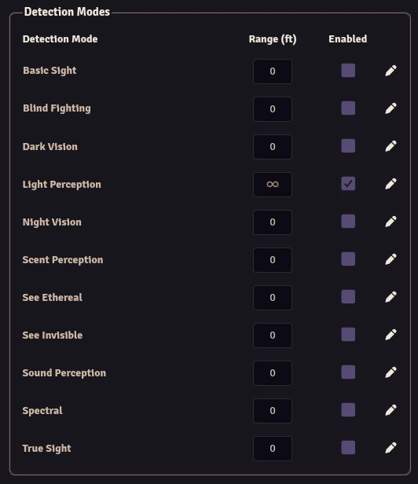

### Annoying Instructional Messages

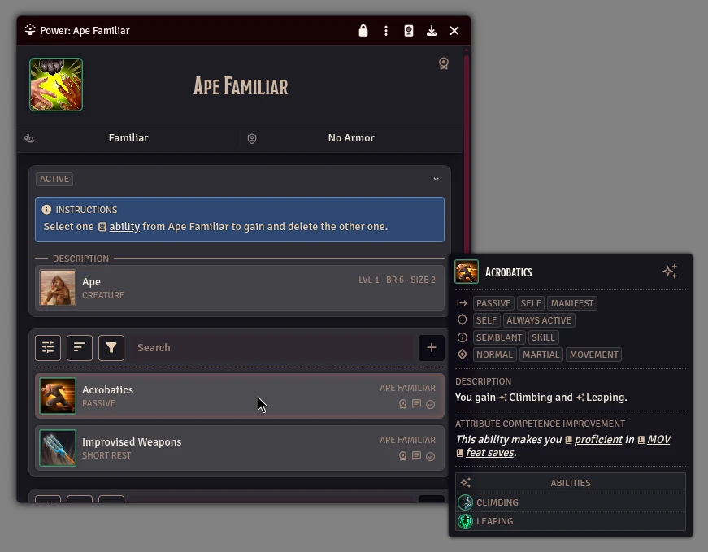

### Other Stuff

And plenty of other things including (but not limited to):

- [Maps!](https://map.teriock.com)
- Custom vision modes
- Internal rules reference
- Wiki integration
- Inventory management helpers
- Custom enrichers
- Excessive dialogs
- Useless spinning Elder Sorcery animations
- Extensive ability automation
- Custom (hand-drawn non-AI) art for all abilities, properties, species, effects, etc.
- Easy integration with Dice So Nice!, [Item Piles](https://github.com/GabePoel/Teriock-FoundryVTT-Item-Piles), and [Token Action HUD](https://github.com/GabePoel/Teriock-FoundryVTT-Token-Action-HUD) modules
