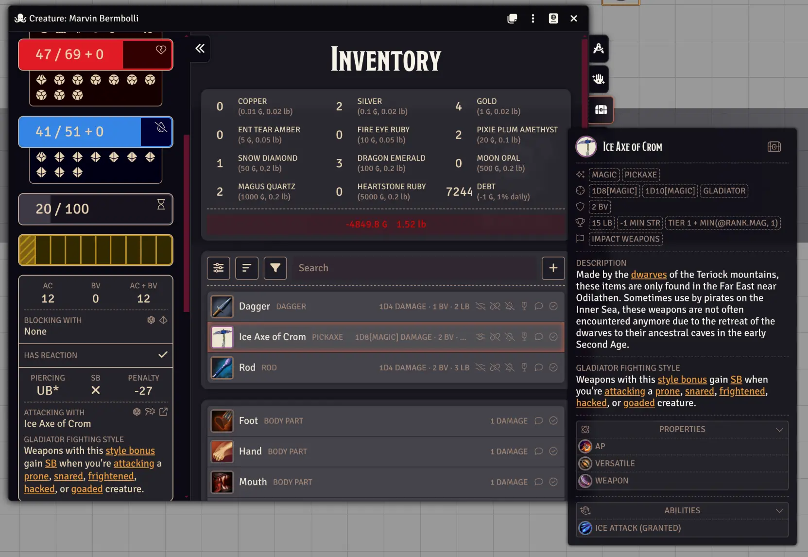

# Teriock Virtual Tabletop

This is a first party implementation of the [Teriock](https://wiki.teriock.com) game system
for [Foundry Virtual Tabletop](http://foundryvtt.com/). It is officially supported and deeply integrated with the
Teriock wiki so that rules and content should be synchronized and up to date.

## Features

### Detailed Sheets and Ability Automation

### All Core Content Built In

### Easy Tooltips and Menus

